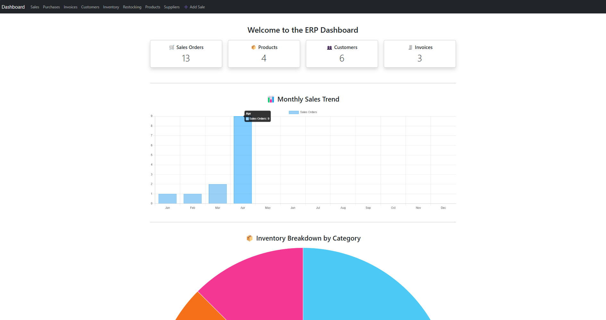

# 🧾 ERP Dashboard (Flask + SQLite)

This is a lightweight, modular ERP system built with **Flask**, **SQLite**, and **HTML/CSS**, designed to manage key operations like **products**, **inventory**, **sales**, **purchase orders**, **invoices**, **customers**, and **suppliers** — all in one place.



---

## 🚀 Features

- 📦 **Product Management**: Add/view product listings with categories and pricing
- 📊 **Inventory Tracking**: Track stock quantities and restocking records
- 🧾 **Sales Orders**: Manage sales transactions with customer and item details
- 🛒 **Purchase Orders**: Record supplier purchases and restock activity
- 👥 **Customers & Suppliers**: Basic CRM and vendor info handling
- 📁 **CSV Import Support**: One-time import scripts for bulk data upload
- 🌐 **Modular Flask Blueprints**: Clean, scalable code structure
- 💡 **Responsive Dashboard UI**: Built with Bootstrap and Jinja templates

---

## 📂 Project Structure

```bash
erp-web/
│
├── app/
│   ├── products/           # Product routes & views
│   ├── inventory/          # Inventory routes & views
│   ├── sales/              # Sales order logic
│   ├── templates/          # HTML templates
│   ├── models.py           # SQLAlchemy models
│   ├── routes.py           # Main dashboard routes
│   ├── __init__.py         # App factory
│   └── extensions.py       # DB/Migration setup
│
├── import_products.py      # One-time script to import products
├── import_sales.py         # One-time script to import sales orders
├── import_purchases.py     # One-time script to import purchase orders
├── products.csv
├── sales.csv
├── purchases.csv
├── requirements.txt
├── run.py
└── README.md


# 1. Clone the repo
git clone https://github.com/yourusername/erp-dashboard.git
cd erp-dashboard

# 2. Create a virtual environment
python -m venv venv
source venv/bin/activate  # or venv\Scripts\activate on Windows

# 3. Install dependencies
pip install -r requirements.txt

# 4. Initialize the database
flask db init
flask db migrate
flask db upgrade

# 5. (Optional) Import sample data
python import_products.py
python import_sales.py
python import_purchases.py

# 6. Run the app
python run.py


